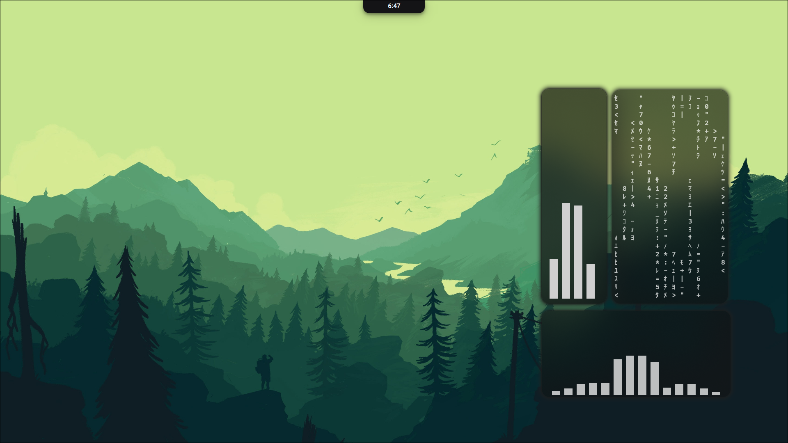

# My Hyprland Dotfiles

A personal [Hyprland](https://hyprland.org/) configuration built with a Lua-based
config layer instead of raw `.conf` files, paired with a custom
[Quickshell](https://github.com/itsawouki/Aki-shell/) bar/widget system, `pyprland` scratchpads,
and a set of Python scripts implementing an "infinite desktop" tiling/navigation
workflow.

> Built on top of [JaKooLit's Hyprland-Dots](https://github.com/JaKooLit/Hyprland-Dots)
> as a base, then reworked into Lua config syntax and extended with custom
> tooling. See [Credits](#-credits) below.



## ✨ Features

- **Lua config** — `hyprland.lua` requires modular files (`Keybinds`, `Decoration`,
  `env`, `monitor`, `layout`, `misc`, `input`, `windowrules`, ...) instead of one
  giant `hyprland.conf`
- **Custom shell UI** via Quickshell (`Aki-Shell`) — control center, clipboard
  island, music widget, power menu, network/audio toggles, wallpaper picker
- **`pyprland`** for dropdown terminal scratchpad and window magnification
- **Infinite desktop** — Python daemon + keybinds for floating/tiled window
  navigation, moving, and resizing across an unbounded canvas
- **Dynamic theming** with `wallust`, including light/dark mode switching tied
  to wallpaper sets
- **Wallpaper tooling** — random/auto-change, per-wallpaper color extraction,
  effects
- **Rofi menus** for app launching, clipboard history (`cliphist`), emoji
  picker, calculator, and a custom `mpv`-based music player (RofiBeats)
- **Waybar** with runtime style/layout switching and a cava audio visualizer
  module
- **`hypridle` / `hyprlock`** for idle handling and screen locking
- **Game mode** toggle that strips animations/blur/shadows for performance
- **NixOS-aware** variants for Polkit where relevant

## 🧰 Stack

| Component           | Tool                                   |
|----------------------|------------------------------------------|
| Compositor           | [Hyprland](https://hyprland.org/)       |
| Config language       | Lua (via `hl.*` API)                    |
| Bar / shell widgets     | Quickshell                              |
| Scratchpads / IPC        | pyprland                                |
| Wallpaper daemon          | swww / awww                             |
| Theming                    | wallust                                 |
| Idle / lock                 | hypridle / hyprlock                     |
| Launcher                     | Rofi                                    |
| Clipboard                     | cliphist                                |
| Terminal                       | kitty                                   |
| File manager                    | Thunar                                  |

## ⌨️ Key Keybinds

All binds use `SUPER` as the main modifier.

| Keybind                       | Action                                |
|---------------------------------|------------------------------------------|
| `SUPER + Return`                  | Open terminal                            |
| `SUPER + T`                          | Open file manager                        |
| `SUPER + Q`                            | Close active window                      |
| `SUPER + F`                              | Toggle fullscreen                        |
| `SUPER + SHIFT + F`                        | Toggle floating                          |
| `SUPER + SHIFT + Return`                     | Toggle dropdown terminal (pyprland)      |
| `SUPER + D`                                    | Toggle app launcher / island             |
| `SUPER + SHIFT + V`                              | Toggle clipboard manager                 |
| `SUPER + A / N / W / S`                            | Toggle audio / network / wallpaper / settings panels |
| `SUPER + B`                                          | Reload waybar                            |
| `SUPER + ALT + E`                                      | Emoji picker                             |
| `CTRL + ALT + L`                                         | Lock screen                              |
| `CTRL + ALT + P`                                           | Power menu (wlogout)                     |
| `SUPER + ALT + <arrows>`                                     | Move tiled window (infinite desktop)     |
| `SUPER + CTRL + <arrows>`                                       | Resize window                            |

Full binds live in [`Keybinds.lua`](./Keybinds.lua) and
[`UserKeybinds.lua`](./UserKeybinds.lua).

## 📁 Structure

```
.
├── hyprland.lua           # entry point, requires all modules below
├── Keybinds.lua            # core keybinds
├── UserKeybinds.lua         # personal/extra keybinds
├── shellkeys.lua              # Aki-Shell (Quickshell) IPC keybinds
├── Startup_Apps.lua             # autostart daemons/apps
├── Decoration.lua / UserDecoration.lua / UserDecorAnimations.conf
├── env.lua                        # environment variables
├── monitor.lua / layout.lua / misc.lua / input.lua / windowsrules.lua
├── hypridle.conf / hyprlock.conf
├── pyprland.toml                    # scratchpads config
├── scripts/                           # core helper scripts (JaKooLit-derived)
└── UserScripts/                         # personal scripts (music, weather, wallpaper, theming)
```

## 📦 Requirements

- `hyprland` (with Lua config support)
- `quickshell`
- `pyprland` (`pypr`)
- `waybar`, `rofi`, `cliphist`, `wl-clipboard`
- `swww`/`awww`, `wallust`
- `hypridle`, `hyprlock`, `wlogout`
- `kitty`, `thunar`
- `python3` (for the infinite-desktop scripts)
- `mpv` + `mpv-mpris`, `jq` (for RofiBeats)

## 🚀 Installation

> ⚠️ These dotfiles are tailored to my machine — review paths and package
> names before using them as-is, especially anything under `~/scripts/` and
> the `Aki-Shell` Quickshell config, which aren't included in this repo.

```bash
git clone https://github.com/<your-username>/<repo-name>.git ~/.config/hypr
```

Then symlink or copy into place, install the dependencies above, and adjust
any hardcoded paths (e.g. `~/scripts/*.py`, `~/.config/Aki-Shell`) to match
your own setup.

## 🙏 Credits

- [JaKooLit/Hyprland-Dots](https://github.com/JaKooLit/Hyprland-Dots) — base
  scripts and structure this config was originally derived from
- [ivanvit100](https://github.com/ivanvit100) — `RofiBeats.sh` music player script

## 📄 License

MIT (or your license of choice) — see [LICENSE](./LICENSE).
